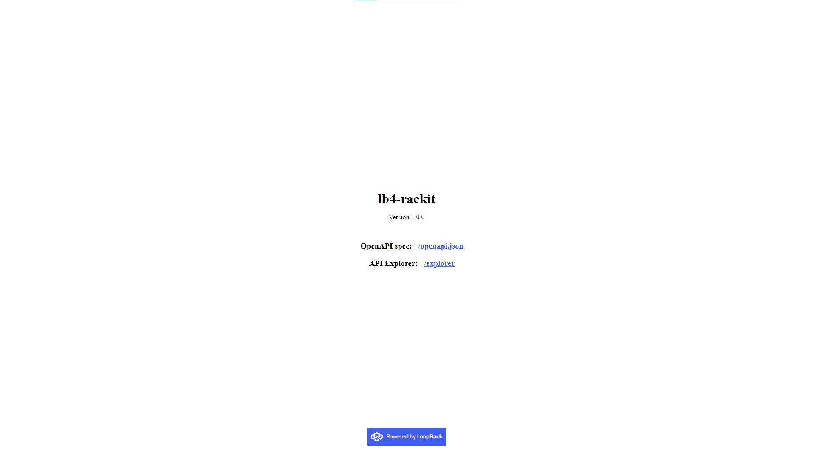
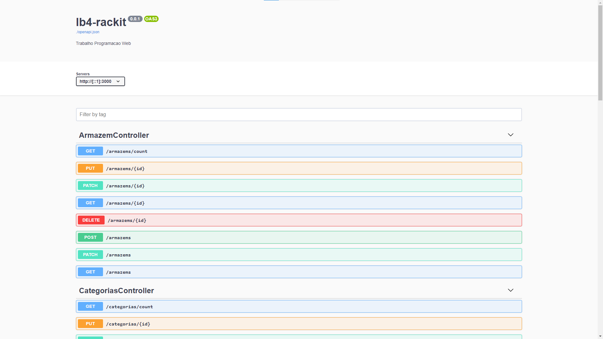
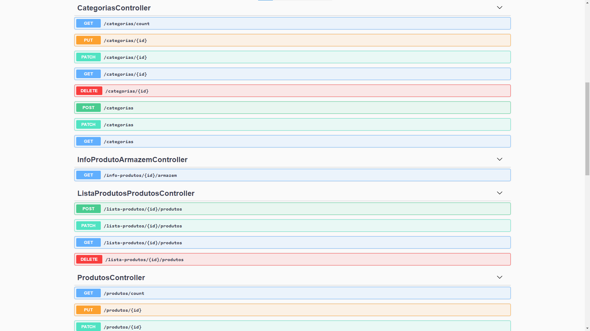
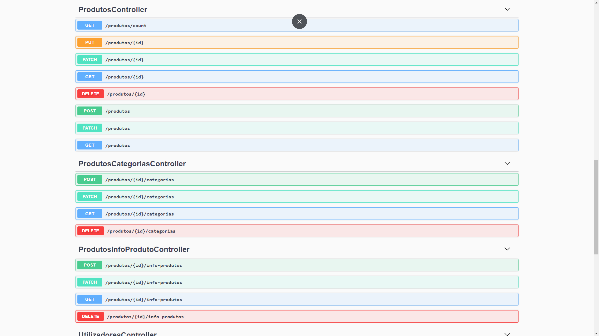
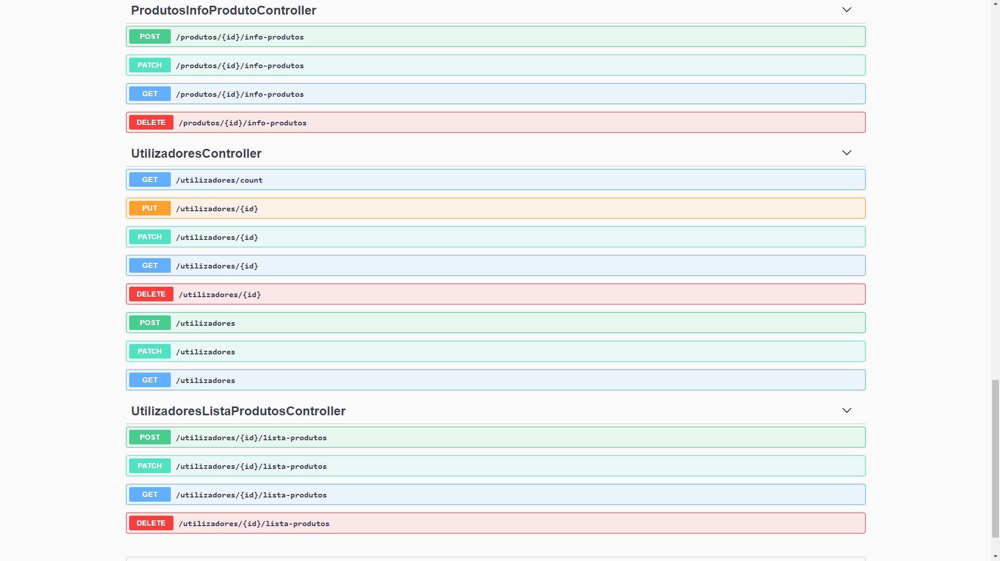

# C2 : Loopback API

### Pagina Inicial
| |
:---: |
 
Página Inicial da API Loopback

### Explorer
| | | | |
:---: | :---: | :---: | :---:
 |  |  | 
ArmazemController |  CategoriasController, InfoProdutoAramazemController, ListaProdutosControlelr, ProdutosController | ProdutosController, ProdutosCategoriasController, ProdutosInfoController | UtilizadoresController, UtilizadoresListaProdutosController

### Relações Base de Dados
| |
:---:
 |
Relações da Base de Dados |
