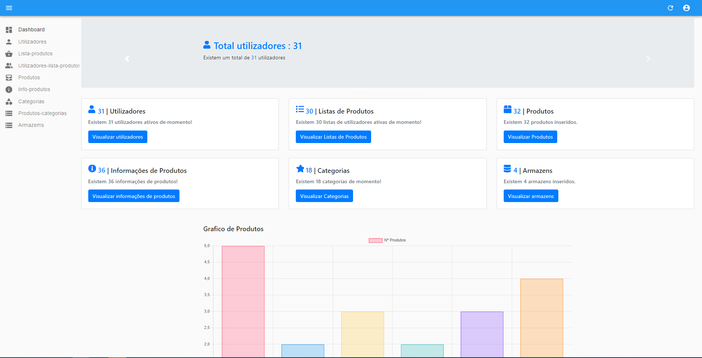

# C2 : User Interface

### Pagina Inicial LoopBack API
| |
:---: |
 
Página Inicial da API Loopback

### Explorer
| | | | |
:---: | :---: | :---: | :---:
 |  |  | 
ArmazemController |  CategoriasController, InfoProdutoAramazemController, ListaProdutosControlelr, ProdutosController | ProdutosController, ProdutosCategoriasController, ProdutosInfoController | UtilizadoresController, UtilizadoresListaProdutosController

---

### Pagina Inicial React
| |
:---: |
 
Página Inicial da RackIT (React dashboard)
Na dashboard o adminstrador consegue obter informações precisas sobre o número total de utilizadores, listas de produtos, produtos, informações dos produtos, categorias e armazens. Bem como consegue ver num grafico de barras a contagem de produtos.

### Diferentes páginas
| | | |
:---: | :---: | :---: |
 |  |  |
Página dos Utilizadores |  Página Lista Produtos | Página Produtos

| | | |
:---: | :---: | :---: |
 |  |  |
Página das Informações dos Produtos |  Página Categorias | Página Armazens

| | |
:---: | :---: |
 |  |
Página n-m Utilizadores-ListaProdutos |  Página n-m Produtos-Categorias | 

---

### Relações Base de Dados
| |
:---:
 |
Relações da Base de Dados |
