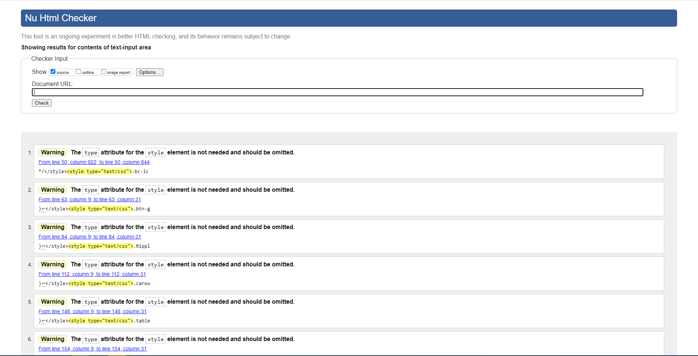

# C3 : Produto

## 3.1 Instalation LB4
<details>
  <summary>Mostrar mais</summary>
  
### lb4-rackit

This application is generated using [LoopBack 4 CLI](https://loopback.io/doc/en/lb4/Command-line-interface.html) with the
[initial project layout](https://loopback.io/doc/en/lb4/Loopback-application-layout.html).

### Install dependencies

By default, dependencies were installed when this application was generated.
Whenever dependencies in `package.json` are changed, run the following command:

```sh
npm install
```

To only install resolved dependencies in `package-lock.json`:

```sh
npm ci
```

### Run the application

```sh
npm start
```

You can also run `node .` to skip the build step.

Open http://127.0.0.1:3000 in your browser.

### Rebuild the project

To incrementally build the project:

```sh
npm run build
```

To force a full build by cleaning up cached artifacts:

```sh
npm run rebuild
```

### Fix code style and formatting issues

```sh
npm run lint
```

To automatically fix such issues:

```sh
npm run lint:fix
```

### Other useful commands

- `npm run migrate`: Migrate database schemas for models
- `npm run openapi-spec`: Generate OpenAPI spec into a file
- `npm run docker:build`: Build a Docker image for this application
- `npm run docker:run`: Run this application inside a Docker container

### Tests

```sh
npm test
```

### What's next

Please check out [LoopBack 4 documentation](https://loopback.io/doc/en/lb4/) to
understand how you can continue to add features to this application.

[-@2x.png)](http://loopback.io/)


  
  ```javascript
  console.log("I'm a code block!");
  ```
  
</details>

## 3.2 Instalation React

<details>
  <summary>Ver mais</summary>
  

# Getting Started with Create React App

This project was bootstrapped with [Create React App](https://github.com/facebook/create-react-app).

## Available Scripts

In the project directory, you can run:

### `npm start`

Runs the app in the development mode.\
Open [http://localhost:3000](http://localhost:3000) to view it in the browser.

The page will reload if you make edits.\
You will also see any lint errors in the console.

### `npm test`

Launches the test runner in the interactive watch mode.\
See the section about [running tests](https://facebook.github.io/create-react-app/docs/running-tests) for more information.

### `npm run build`

Builds the app for production to the `build` folder.\
It correctly bundles React in production mode and optimizes the build for the best performance.

The build is minified and the filenames include the hashes.\
Your app is ready to be deployed!

See the section about [deployment](https://facebook.github.io/create-react-app/docs/deployment) for more information.

### `npm run eject`

**Note: this is a one-way operation. Once you `eject`, you can’t go back!**

If you aren’t satisfied with the build tool and configuration choices, you can `eject` at any time. This command will remove the single build dependency from your project.

Instead, it will copy all the configuration files and the transitive dependencies (webpack, Babel, ESLint, etc) right into your project so you have full control over them. All of the commands except `eject` will still work, but they will point to the copied scripts so you can tweak them. At this point you’re on your own.

You don’t have to ever use `eject`. The curated feature set is suitable for small and middle deployments, and you shouldn’t feel obligated to use this feature. However we understand that this tool wouldn’t be useful if you couldn’t customize it when you are ready for it.

## Learn More

You can learn more in the [Create React App documentation](https://facebook.github.io/create-react-app/docs/getting-started).

To learn React, check out the [React documentation](https://reactjs.org/).

### Code Splitting

This section has moved here: [https://facebook.github.io/create-react-app/docs/code-splitting](https://facebook.github.io/create-react-app/docs/code-splitting)

### Analyzing the Bundle Size

This section has moved here: [https://facebook.github.io/create-react-app/docs/analyzing-the-bundle-size](https://facebook.github.io/create-react-app/docs/analyzing-the-bundle-size)

### Making a Progressive Web App

This section has moved here: [https://facebook.github.io/create-react-app/docs/making-a-progressive-web-app](https://facebook.github.io/create-react-app/docs/making-a-progressive-web-app)

### Advanced Configuration

This section has moved here: [https://facebook.github.io/create-react-app/docs/advanced-configuration](https://facebook.github.io/create-react-app/docs/advanced-configuration)

### Deployment

This section has moved here: [https://facebook.github.io/create-react-app/docs/deployment](https://facebook.github.io/create-react-app/docs/deployment)

### `npm run build` fails to minify

This section has moved here: [https://facebook.github.io/create-react-app/docs/troubleshooting#npm-run-build-fails-to-minify](https://facebook.github.io/create-react-app/docs/troubleshooting#npm-run-build-fails-to-minify)

  
  ```javascript
  console.log("I'm a code block!");
  ```
  
</details>

## 3.3 Application/Product help

A aplicação em React é de facil uso, sendo que tem um dashboard do lado esquerdo com os diferentes menus existentes. 
Consultar para mais informação [C4- Apresentação](https://github.com/RackITPW/report/blob/main/docs/c4.md).


## 3.4 Forms

Todas as forms estão a ser validadas utilizando componentes do [react-admin](https://marmelab.com/react-admin/Readme.html).


## 3.5 HTML5 and CSS3 validation

Todas as paginas foram validadas utilizando o site da [w3](https://validator.w3.org/) sendo que em todas as paginas obtivemos resultados semelhantes a este.
<details>
    <summary>Ver mais informações</summary>
  
**Os warnings são devidos a um componente do react-admin que injeta o type no style automaticamente enquanto este não é preciso.**

| |
:---: |
 

  
</details>

## 3.6 Implementation details

#### Para este trabalho foram realizados os seguintes objetivos.
#### Parte 1
1. Arquitetura de serviços do tipo REST; ✔️ 
2. Utilização de pelo menos 4 verbos (métodos) do protocolo HTTP - CRUD (do inglês: Criar, Ler, Actualizar e
Apagar); ✔️              
( [Imagem de exemplo](https://github.com/RackITPW/report/blob/main/docs/images/4metodos.PNG) )
3. Disponibilizar pelo menos 4 recursos diferentes; ✔️ ( [Imagem de exemplo](https://github.com/RackITPW/report/blob/main/docs/images/4recursos.PNG) )
4. Utilização de pelo menos uma relação de cardinalidade 1:n entre dois dos recursos; ✔️ 
5. Disponibilização das representações de estado dos recursos em JSON; ✔️ 
6. Documentar a API com recurso ao formato OpenAPI 3.0; ✔️ ( [Ficheiro referente](https://github.com/RackITPW/report/blob/main/docs/openapiRackIT_updated.json) )
7. Disponibilizar uma ‘Collection’ para o Postman para consulta dos recursos; ✔️ 
8. Utilização do MySQL como SGBD; ✔️  ( [Ficheiros referentes](https://github.com/RackITPW/report/blob/main/bd/mysqlRackIT_update) ) 
9. Utilização de Node.js como servidor aplicacional para implemnetação da camada de serviços. ✔️ 

Valoriza-se o desenvolvimento/utilização de:
1. Filtros através de parâmetros HTTP; ✔️ ( [Imagem de exemplo](https://github.com/RackITPW/report/blob/main/docs/images/filtrosparametrosHTTP.PNG) )
2. Utilização de relação de cardinalidade m:n entre dois dos recusros; ✔️ ( [Imagem de exemplo](https://github.com/RackITPW/report/blob/main/bd/relacoesBD/modelo.PNG) )
3. Possibilidade de seleccionar o tipo de representação pretendida através do cabeçalho HTTP Accept (suporte
por exemplo para XML); ❌

#### Parte 2

1. Desenvolvimento de uma aplicação web responsiva; ✔️ 
2. Utilização da biblioteca ReactJS; ✔️ 
3. Edição (CRUD) de pelo menos 4 recursos disponibilizados na API REST (da parte 1 do enunciado); ✔️ 
4. Apresentação de pelo menos um elemento com um valor agregado (contador, somatório, …); ✔️ ( [Imagem de exemplo](https://github.com/RackITPW/report/blob/main/docs/images/dashboardReact.PNG) )
5. Nas relações 1:n e n:m entre recursos, possibilitar a navegação entre recursos relacionados; ✔️ (todos os recursos 1:n e n:m possibilitam a navegação entre recursos) 
6. Apresentar um dashboard; ✔️ ( [Imagem de exemplo](https://github.com/RackITPW/report/blob/main/docs/images/dashboardReact.PNG) )
7. Inclusão no relatório de uma avaliação da validação do HTML5 e CSS (W3C Validator ou outro). ✔️ ( [Imagem de exemplo](https://github.com/RackITPW/report/blob/main/docs/images/validador.PNG) )

Valoriza-se o desenvolvimento/utilização de:
1. Disponibilizar a utilização de filtros nas listagens; ✔️ ( [Imagem de exemplo](https://github.com/RackITPW/report/blob/main/docs/images/infoProdutosFilter.PNG) )
